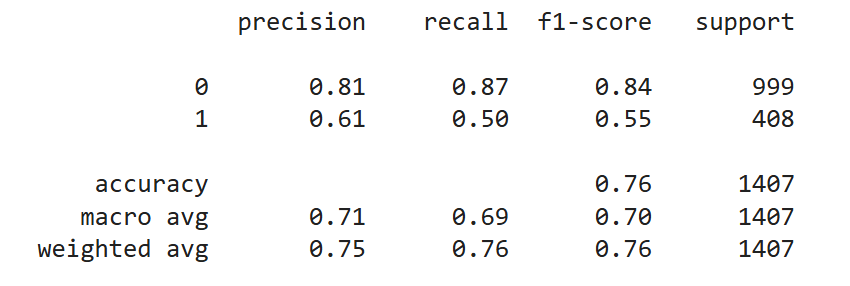
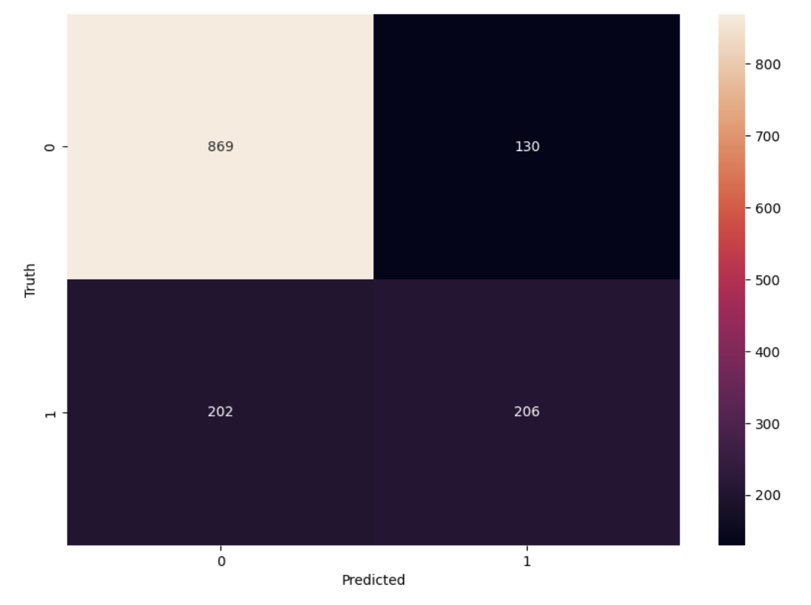
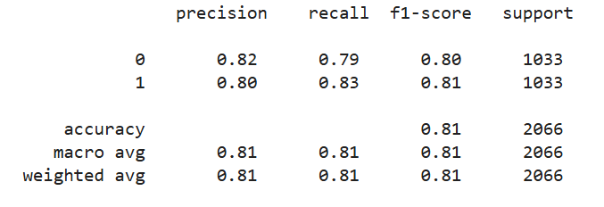
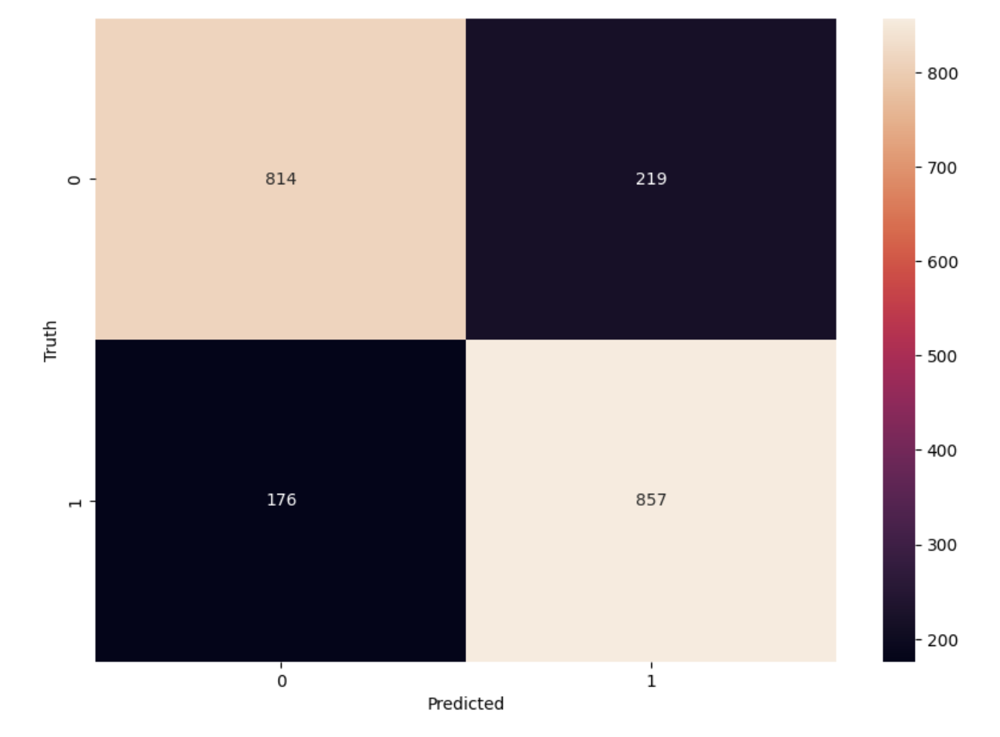
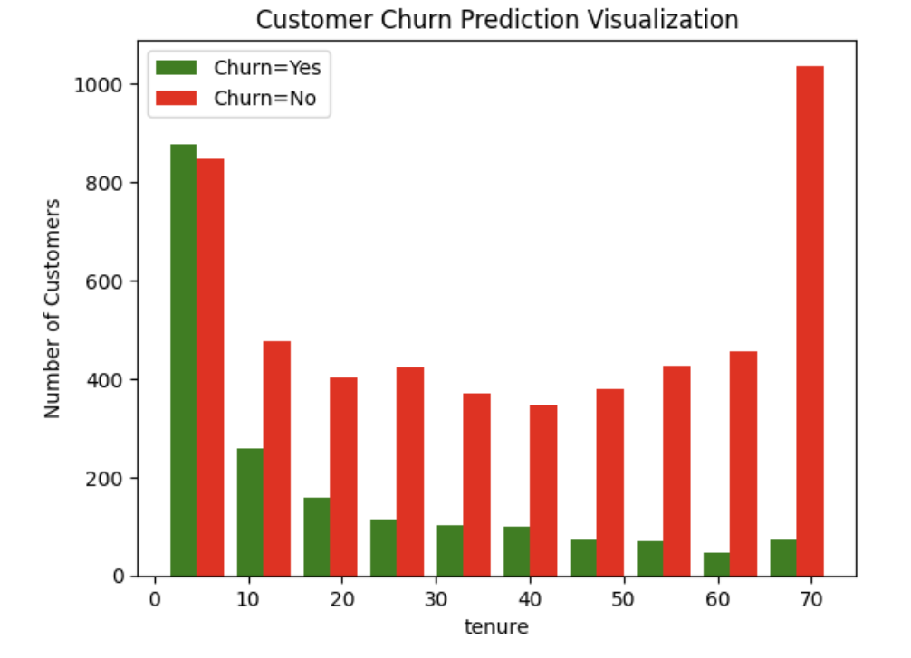

# Customer Churn Prediction Using ANN (Artificial Neural Network) 
This repository contains two complete models for predicting customer churn using Artificial Neural Networks (ANN) built with TensorFlow/Keras. The objective is to analyze telecom customer behavior and predict whether a customer will churn or stay.
What makes this project strong is that it includes both a baseline ANN model and an enhanced version with imbalanced data handling (SMOTE). 

**Dataset :** https://www.kaggle.com/datasets/blastchar/telco-customer-churn  

📂 ***Files Included in This Repository*** 

Customer churn prediction using ANN             
- Standard ANN model trained on the original dataset 

Customer churn prediction using ANN - 2
- Improved ANN model using SMOTE to handle class imbalance  

🚀 ***Model 1 — Baseline ANN (Without Handling Imbalance)***  

📌 Dataset Nature → Imbalanced 
Churn = Yes (minority) < Churn = No (majority) 

    
  

📈 Good accuracy, but imbalance affects churn detection performance.  

🚀 ***Model 2 — ANN + SMOTE (Imbalanced Data Solved)***  

📌 Dataset Nature → SMOTE was applied to oversample minority churn class — balancing dataset. 

Churn = 0 
Before       : 5163 
After SMOTE  : 5163 

Churn = 1 
Before       : 1869 
After SMOTE  : 5163 (balanced) 

    
  

📈 Balanced recall between churn vs non-churn
📈 Much better customer churn detection
📈 More business actionable model  

✔ Churn vs Tenure Distribution 
 

✔ Churn vs Monthly Charges 
 
